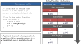

<!--
SPDX-FileCopyrightText: Copyright 2019, 2021-2022 Arm Limited and/or its affiliates <open-source-office@arm.com>
CC-BY-SA-4.0 AND Apache-Patent-License
See LICENSE.md file for details
-->

<!---
**** Do not remove! ****
The two lines following this comments are necessary
to generate the Table of Contents via Jekyll.
They are automatically removed by the scripts that generates the pdfs.
-->
* TOC
{:toc}

# Preface

## Abstract

This document describes the requirements on Development Tools in order to
support Armv8-M and Armv8.1-M Security Extensions or the new TT instruction of
Armv8-M.

## Keywords

ACLE, ABI, CMSE, Armv8-M, Armv8.1-M, Security, Extensions, toolchain,
requirements, compiler, linkerarm.

## Latest release and defects report

For the latest release of this document, see the [ACLE project on
GitHub](https://github.com/ARM-software/acle).

Please report defects in this specification to the [issue tracker page
on GitHub](https://github.com/ARM-software/acle/issues).

## License

This work is licensed under the Creative Commons
Attribution-ShareAlike 4.0 International License. To view a copy of
this license, visit <http://creativecommons.org/licenses/by-sa/4.0/> or
send a letter to Creative Commons, PO Box 1866, Mountain View, CA
94042, USA.

Grant of Patent License. Subject to the terms and conditions of this
license (both the Public License and this Patent License), each
Licensor hereby grants to You a perpetual, worldwide, non-exclusive,
no-charge, royalty-free, irrevocable (except as stated in this
section) patent license to make, have made, use, offer to sell, sell,
import, and otherwise transfer the Licensed Material, where such
license applies only to those patent claims licensable by such
Licensor that are necessarily infringed by their contribution(s) alone
or by combination of their contribution(s) with the Licensed Material
to which such contribution(s) was submitted. If You institute patent
litigation against any entity (including a cross-claim or counterclaim
in a lawsuit) alleging that the Licensed Material or a contribution
incorporated within the Licensed Material constitutes direct or
contributory patent infringement, then any licenses granted to You
under this license for that Licensed Material shall terminate as of
the date such litigation is filed.

### About the license

As identified more fully in the [License](#license) section, this project
is licensed under CC-BY-SA-4.0 along with an additional patent
license. The language in the additional patent license is largely
identical to that in Apache-2.0 (specifically, Section 3 of Apache-2.0
as reflected at <https://www.apache.org/licenses/LICENSE-2.0>) with two
exceptions.

First, several changes were made related to the defined terms so as to
reflect the fact that such defined terms need to align with the
terminology in CC-BY-SA-4.0 rather than Apache-2.0 (e.g., changing
“Work” to “Licensed Material”).

Second, the defensive termination clause was changed such that the
scope of defensive termination applies to “any licenses granted to
You” (rather than “any patent licenses granted to You”).  This change
is intended to help maintain a healthy ecosystem by providing
additional protection to the community against patent litigation
claims.

## Contributions

Contributions to this project are licensed under an inbound=outbound
model such that any such contributions are licensed by the contributor
under the same terms as those in the LICENSE file.

We do not require copyright assignment. The original contributor will
retain the copyright.

## Trademark notice

The text of and illustrations in this document are licensed by Arm
under a Creative Commons Attribution–Share Alike 4.0 International
license ("CC-BY-SA-4.0”), with an additional clause on patents.
The Arm trademarks featured here are registered trademarks or
trademarks of Arm Limited (or its subsidiaries) in the US and/or
elsewhere. All rights reserved. Please visit
<https://www.arm.com/company/policies/trademarks> for more information
about Arm’s trademarks.

## Copyright

Copyright 2019, 2021-2022 Arm Limited and/or its affiliates <open-source-office@arm.com>.

# ABOUT THIS DOCUMENT

## Change control

### Current status and anticipated changes

This document is a development version based on release 1.1.

Anticipated changes to this document include:

* Typographical corrections.
* Clarifications.
* Compatible extensions.

### Change history

| Issue | Date          | By   | Change         |
| :---  | :---          | :--- | :---           |
| 1.0   | 23/10/2015    | Arm  | First release  |
| 1.1   | 01/11/2019    | Arm  | Second release |
| 1.2   | 06 April 2022 | Arm  | See [Changes for version 1.2](#changes-for-version-1.2)|

#### Changes for version 1.2

* Publication of the specifications in open source format.
* Internal references to sections and figures use section title and
  figure caption instead of reference numbers.
* Section numbering has changed because of the introduction of the
  [Preface](#preface) chapter.
* Fixed the definition of macro `cmse_check_pointed_object` in
  [Non-trivial macros](#non-trivial-macros), as specified in
  requirement [30](#requirement-30).
* Fixed the example of a non-secure function call in figure [Caller's
  stack frame of a non-secure function call](#figure6) from `struct s
  NS nsfunc(struct s);` to `struct s NS (*nsfunc)(struct
  s);`. Non-secure functions have to be function pointers.

## References

This document refers to the following documents.

| Ref                                                      | Doc No                                                 | Author(s) | Title                                                                  |
| :---                                                     | :---                                                   | :---      | :---                                                                   |
| <span id="AAELF" class="citation-label">[AAELF]</span>   | ARM IHI 0044E                                          |           | ELF for the Arm® Architecture                                          |
| <span id="AAPCS" class="citation-label">[AAPCS]</span>   | ARM IHI 0042E                                          |           | Procedure Call Standard for the Arm® Architecture                      |
| <span id="ACLE" class="citation-label">[ACLE]</span>     | ARM IHI 0053C                                          |           | Arm® C Language Extensions Release 2.0                                 |
| <span id="BSABI" class="citation-label">[BSABI]</span>   | ARM IHI 0036B                                          |           | Application Binary Interface for the Arm® Architecture (Base Standard) |
| <span id="ISOC" class="citation-label">[ISOC]</span>     | ISO/IEC 9899:2011                                      | ISO/IEC   | Programming Language C                                                 |
| <span id="ARMV8M" class="citation-label">[ARMV8M]</span> | ARM DDI 0553a Armv8-M Architecture Reference Manual[ ] |           |                                                                        |

## Terms and abbreviations

This document uses the following terms and abbreviations.

| Term                     | Meaning                                                                                                                                                  |
|--------------------------|----------------------------------------------------------------------------------------------------------------------------------------------------------|
| CMSE                     | Armv8-M Security Extensions.                                                                                                                             |
| SAU                      | Security Attribute Unit. Controls the separation of secure and non-secure memory regions.                                                                |
| IDAU                     | Implementation Defined Attribute Unit.  Enables system logic outside the processor to separate secure and non-secure memory regions, similar to the SAU. |
| MPU                      | Memory Protection Unit. Controls the permissions that privileged and unprivileged execution modes have, memory region by memory region.                  |
| NSC region               | Non-Secure Callable memory region. Secure memory that is callable by code executing in non-secure state.                                                 |
| SG                       | Secure Gateway Instruction. Switches to secure state.                                                                                                    |
| TT                       | Test Target Instruction. Used to inspect MPU, SAU, and IDAU configurations.                                                                              |
| Entry function           | A function in secure memory that can be called from secure and non-secure state.                                                                         |
| Non-secure function call | A function call in secure memory that switches to non-secure state.                                                                                      |
| Secure gateway           | Occurrence of an SG instruction in a NSC region.                                                                                                         |
| Secure gateway veneer    | A code sequence that provides a secure gateway to an entry function.                                                                                     |
| LSB                      | Least Significant Bit.                                                                                                                                   |
| A32                      | Instruction set previously known as Arm®.                                                                                                                |
| T32                      | Instruction set previously known as Thumb®.                                                                                                              |

# SCOPE

## Scope

Armv8-M Security Extensions is in some contexts known as Cortex®-M Security
Extensions and is referred to as CMSE throughout this document. The Armv8.1-M
Mainline architecture continues support for Armv8-M Security Extensions and this
document refers to both by Armv8-M unless otherwise specified.

This document states the requirements that development tools must satisfy in
order to develop software in C that uses the feature defined by CMSE. This
document describes a machine-level standard that can be mapped directly by
functions written in C and assembly language.

This document also describes the support for the new `TT` instruction introduced
in Armv8-M. This instruction is not part of CMSE, but is closely related.

Some of the requirements defined by this document will be included in future
[[ACLE]](#ACLE) and [[BSABI]](#BSABI) documents.

## Conventions

This document consists of informative text and requirements.

<span id="requirement-0" class="requirement-box"></span>

> Requirements are numbered in the left margin and highlighted as shown here.

A permanent unique reference consists of the document number, document version,
and requirement number.

# OVERVIEW OF CMSE

## Introduction

CMSE is an optional part of the Armv8-M baseline and mainline architecture 
defined by [[ARMV8M]](#ARMV8M). CMSE is designed to combine code from multiple
vendors without requiring trust between them. CMSE gives vendors the ability to
protect their software assets (code and data) by restricting access to the
memory where their software assets reside, except for a set of explicitly
exported entry points that are defined by the vendor. This supports the creation
of a trusted software stack that provides features such as secure remote
firmware updates, while significantly reducing the attack surface of such code.
This is an important feature for any network-connected device that can be
updated after deployment, including any IoT device.

CMSE defines a system-wide division of physical memory into _secure regions_ and
_non-secure regions_ and two system-wide _security states_ that are enforced by
hardware. There is a direct relation between the memory regions and the security
states:

* Code executed from a non-secure region (_non-secure code_) is executed in
  _non-secure state_ and can only access memory in non-secure regions.
* Code executed from a secure region (_secure code_) is executed in 
  _secure state_ and can access memory in both secure and non-secure
  regions.[ ]

Attempts to access secure regions from non-secure code or a mismatch
between the (secure or non-secure) code that executes and the security
state of the system, results in a _SecureFault_.

The security states are orthogonal to the exception level, as shown in figure
[Diagrammatic representation of secure states](#figure1).


Memory regions can be defined by the system through the _IDAU_ or can be
controlled in software through the memory mapped _SAU_ registers.

Parts of the system are banked between the security states. The stack pointer is
banked, resulting in a stack pointer for each combination of security state and
exception level. All parts of the system accessible in non-secure state can be
accessed in secure state as well, including the banked parts.

###  Security state changes

The system boots in secure state and can change security states using
branches as shown in figure [Security state transitions](#figure2).


Transitions from secure to non-secure state can be initiated by software through
the use of the `BXNS` and `BLXNS` instructions that have the 
_Least Significant Bit_ (LSB) of the target address unset.

Note: The M profile architecture does not support the A32 instruction set. This
allows the LSB of an address to denote the security state.

Transitions from non-secure to secure state can be initiated by software in two ways:

* A branch to a _secure gateway_.
* A branch to the reserved value `FNC_RETURN`.

A secure gateway is an occurrence of the Secure Gateway instruction (`SG`) in a
special type of secure region, named a _Non-Secure Callable_ (NSC) region. When
branching to a secure gateway from non-secure state, the SG instruction switches
to the secure state and clears the LSB of the return address in `lr`. In any
other situation the SG instruction does not change the security state or modify
the return address.

A branch to the reserved value `FNC_RETURN` causes the hardware to switch to
secure state, read an address from the top of the secure stack, and branch to
that address. The reserved value `FNC_RETURN` is written to lr when executing
the `BLXNS` instruction.

Security state transitions can be caused by hardware through the handling of
interrupts. Those transitions are transparent to software and are ignored in the
remainder of this document.

## The TT instruction
The Armv8-M architecture introduces the Test Target instruction (`TT`). The `TT`
instruction takes a memory address and returns the configuration of the 
_Memory Protection Unit_ (MPU) at that address. An optional `T` flag controls
whether the permissions for the privileged or the unprivileged execution mode
are returned.

When executed in the secure state the result of this instruction is extended to
return the SAU and IDAU configurations at the specific address. 

The MPU is banked between the two security states. The optional `A` flag makes
the `TT` instruction read the MPU of the non-secure state when the `TT`
instruction is executed from the secure state.

The TT instruction is used to check the access permissions that different
security states and privilege levels have on memory at a specified address.

## Secure code requirements

To prevent secure code and data from being accessed from non-secure state,
secure code must meet at least the requirements listed in this section. The
responsibility for meeting these security requirements is shared between
hardware, toolchain and software developer. The remainder of this document
specifies requirements a toolchain must meet to enable C programmers to meet
these security requirements.

### Information leakage

Information leakage from the secure state to the non-secure state might occur
through parts of the system that are not banked between the security states.
The unbanked registers that are accessible by software are:

* General purpose registers except for the stack pointer (`r0-r12`, `r14-r15`).
* Floating point registers (`S0-S31`, `D0-D15`).
* The `N`, `Z`, `C`, `V`, `Q`, and `GE` bits of the `APSR` register.
* The `FPSCR` register.

<span id="requirement-1" class="requirement-box"></span>

> Secure code must clear secret information from unbanked
> registers before it initiate a transition from secure to non-secure
> state.

### Non-secure memory access
When secure code needs to access non-secure memory using an address calculated
by the non-secure state, it cannot trust that the address lies in a non-secure
memory region. Furthermore, the MPU is banked between the security states.
Therefore secure and non-secure code might have different access rights to
non-secure memory.

<span id="requirement-2" class="requirement-box"></span>

> Secure code that accesses non-secure memory on behalf of the non-secure
> state must only do so if the non-secure state has permission to perform the
> same access itself.

The secure code can use the `TT` instruction to check non-secure memory
permissions.

<span id="requirement-3" class="requirement-box"></span>

> Secure code must not access non-secure memory unless it does so on behalf
> of the non-secure state.

Data belonging to secure code must reside in secure memory.

### Volatility of non-secure memory

Non-secure memory can be changed asynchronously to the execution of secure code.
There are two causes:

* Interrupts handled in non-secure state can change non-secure memory.
* The debug interface can be used to change non-secure memory.

There can be unexpected consequences when secure code accesses non-secure memory:

``` c
int array[N]
void foo(int *p) {
    if (*p >= 0 && *p < N) {
        // non-secure memory (*p) is changed at this point
        array[*p] = 0;
    }
}
```

When the pointer p points to non-secure memory, it is possible for its value to
change after the memory accesses used to perform the array bounds check, but
before the memory access used to index the array. This asynchronous change
to non-secure memory would render this array bounds check useless.

<span id="requirement-4" class="requirement-box"></span>

> Secure code must handle non-secure memory as volatile.

The introductory example of the section [Volatility of non-secure
memory](#volatility-of-non-secure-memory) shows a case that you can
handle as follows:

``` c
int array[N]
void foo(volatile int *p) {
    int i = *p;    
    if (i >= 0 && i < N) {
        array[i] = 0;
    }
}
```

Situations that the toolchain must handle are described in [Non-secure
memory usage](#non-secure-memory-usage).

### Inadvertent secure gateway

An SG instruction can occur inadvertently. This can happen in the following cases:

* Uninitialized memory.
* General data in executable memory, for example jump tables.
* A 32-bit wide instruction that contains the bit pattern `1110 1001 0111 1111`
  in its first half-word that follows an SG instruction, for example two
  successive `SG` instructions.
* A 32-bit wide instruction that contains the bit pattern `1110 1001 0111 1111`
  in its last half-word that is followed by an `SG` instruction, for example an
  `SG` instruction that follows an `LDR` (immediate) instruction.

If an inadvertent `SG` instruction occurs in an NSC region, the result is an
inadvertent secure gateway.

<span id="requirement-5" class="requirement-box"></span>

> Memory in an NSC region must not contain an inadvertent SG instruction.

The secure gateway veneers introduced in [Secure gateway
veneers](#secure-gateway-veneers) limit the instructions that need to
be placed in NSC regions. If the NSC regions contain only these
veneers, an inadvertent secure gateway cannot occur.

## Development tools

### Source level security state changes

Development tools are expected to provide C and assembly language support for
interacting between the security states. Code written in C++ must use extern “C”
linkage for any inter-state interaction. 

<span id="requirement-6" class="requirement-box"></span>

> Security state changes must be expressed through function calls and returns.

This provides an interface that fits naturally with the C language.
A function in secure code that can be called from the non-secure state through
its secure gateway is called an _entry function_. A function call from secure
state to the non-secure state is called a _non-secure function call_. This is
shown in [Security state transitions](#figure2).

### Executable files

There are two different types of executable files, one for each security state.
The secure state executes secure code from a _secure executable file_. The
non-secure state executes non-secure code from a _non-secure executable file_.
The secure and non-secure executable files are developed independently of each
other. 

<span id="requirement-7" class="requirement-box"></span>

> A non-secure executable is unaware of security states.

From the point of view of the non-secure state, a call to a secure gateway is a
regular function call, as is the return from a non-secure function call. It is
therefore required that a non-secure executable file can be developed using a
toolchain that is not aware of CMSE.

Developing a secure executable file requires toolchain support whenever a
function is called from, calls, or returns to non-secure state and whenever
memory is accessed through an address provided by the non-secure state. The
secure code ABI is otherwise identical to the non-secure code ABI.

For Armv8-M Mainline there are occasions where there is no possible
code-generation that abides the VFP ABI rule that mandates that
exception-control bits of the FPSCR may only be modified by specific support
functions.  After returning from an entry call or when performing a
nonsecure-call using the hard-float ABI the FPSCR will have been initialized
with the secure world’s default FPSCR, the FPDSCR_S. For the soft-float ABI
this is not the case as the VLSTM and VLDM instructions may be used. Armv8.1-M
Mainline introduces instructions that enable the saving and restoring of the FP
context. These are the VMSR, VMRS, VSTR and VLDR to system registers FPCXTNS and
FPCXTS.

The interaction between developers of secure code, non-secure code,
and (optional) security agnostic library code is shown in [Files
shared between parties](#figure3).


The secure gateway import library, shortened to _import library_, contains the
addresses of the secure gateways of the secure code. This import library
consists of or contains a relocatable file that defines symbols for all the
secure gateways. The non-secure code links against this import library to use
the functionality provided by the secure code.

<span id="requirement-8" class="requirement-box"></span>

> A relocatable file containing only copies of the (absolute) symbols of the
> secure gateways in the secure executable must be available to link non-secure
> code against.

Linking against this import library is the only requirement on the toolchain
used to develop the non-secure code. This functionality is very similar to
calling ROM functions, and is expected to be available in existing toolchains.

### Secure gateway veneers

<span id="requirement-9" class="requirement-box"></span>

> A toolchain must support generating a _secure gateway veneer_ for each entry
> function with external linkage. It consists of an `SG` instruction followed by
> a `B.W` instruction that targets the entry function it veneers.

Secure gateway veneers decouple the addresses of secure gateways (in NSC
regions) from the rest of the secure code. By maintaining a vector of secure
gateway veneers at a forever-fixed address, the rest of the secure code can be
updated independently of non-secure code. This also limits the amount of code
in NSC regions that potentially can be called by the non-secure state.

<span id="requirement-10" class="requirement-box"></span>

> A secure gateway veneer must be labelled by an ELF symbol that has the
> same binding, type, and name as the function it veneers, following the rules
> for C entities as defined by [[AAELF]](#AAELF).

To prevent duplicate symbol names, an entry function will “lose” its standard
symbol when its secure gateway veneer is created. For instance, the compiler
could use weak symbols for entry functions.

<span id="requirement-11" class="requirement-box"></span>

> A toolchain must support creating a vector of secure gateway veneers
> consisting of one or more veneers placed consecutively in memory.

Vectors of secure gateway veneers are expected to be placed in NSC memory. All
other code in the secure executable is expected to be placed in secure memory
regions. This placement is under your control.

Preventing inadvertent secure gateways as described in [Inadvertent
secure gateway](#inadvertent-secure-gateway) is a responsibility
shared between you and the toolchain in use. A toolchain must make
it possible for you to avoid creating inadvertent secure
gateways.

<span id="requirement-12" class="requirement-box"></span>

> Excluding the first instruction of a secure gateway veneer, a veneer must
> not contain the bit pattern of the SG instruction on a 2-byte boundary.

<span id="requirement-13" class="requirement-box"></span>

> A vector of secure gateway veneers must be aligned to a 32-byte boundary,
> and must be zero padded to a 32-byte boundary.

You should take care that the code or data before the vector of secure
gateway veneers does not create an inadvertent secure gateway with the first
secure gateway veneer in the vector. Arm recommends placing the vector of secure
gateway veneers at the start of a NSC region.

<span id="requirement-14" class="requirement-box"></span>

> You must have granted control of the position of secure
> gateway veneers in a vector.

This last requirement gives you complete control over the address of a
secure gateway veneer. It allows you to fix the addresses of the
secure gateway veneers such that secure code can be updated independently of
non-secure code.

[Secure executable memory layout](#figure4) shows the memory layout of a secure executable.


### Example C level development flow of secure code

The example in this section shows the creation of a secure executable and its
corresponding import library starting from C sources. The example uses some
features that are described later in this document.

The interface visible to non-secure code is defined in the header file 
`myinterface.h` as follows:

``` c
int entry1(int x);
int entry2(int x);
```

The implementation of this interface is given by the following C code:

``` c
#include <arm_cmse.h>
#include “myinterface.h”
int func1(int x) { return x; }
int __attribute__((cmse_nonsecure_entry)) entry1(int x) { return func1(x) ; }
int __attribute__((cmse_nonsecure_entry)) entry2(int x) { return entry1(x); }
```

In addition to the implementation of the two entry functions, the code defines
the function func1() which can only be called by secure code. The example C
source is not a complete application in itself. The main entry point function is
very platform dependent so is not included in this example.

When a compiler translates the above C code, it might produce the following
assembly:

``` c
func1:
 BX lr
entry1:
__acle_se_entry1:
 PUSH {r11, lr}
 BL func1
 POP {r11, lr}
 BXNS lr
entry2:
__acle_se_entry2:
 PUSH {r11, lr}
 BL entry1
 POP {r11, lr}
 BXNS lr
.weak entry1, entry2
```

An entry function starts with two symbols labelling its start; it does
not start with an SG instruction. This indicates an entry function to
the linker.  Note: alternatively, the compiler can use the
`__acle_se_entry1` symbol rather than the `entry1` symbol in function
`entry2`. This would make the function call skip the secure gateway
veneer.

When the relocatable file corresponding to this assembly code is linked into an
executable file, the linker creates the following veneers in a section
containing only entry veneers:

``` c
entry1:
 SG
 B.W __acle_se_entry1
entry2:
 SG
 B.W __acle_se_entry2
```

Note: the section with the veneers is aligned on a 32-byte boundary and
padded to a 32-byte boundary. Placement of the section with the veneers is under
your control, but must be in an NSC region.

In addition to the final executable, our example linker also produces the import
library for non-secure code. Assuming the section with veneers is placed at
address 0x100, the import library consists of a relocatable file which contains
only a symbol table with the following entries:

| Symbol type                         | Name   | Address |
|-------------------------------------|--------|---------|
| `STB_GLOBAL`, `SHN_ABS`, `STT_FUNC` | entry1 | 0x101   |
| `STB_GLOBAL`, `SHN_ABS`, `STT_FUNC` | entry2 | 0x109   |

Finally, the secure executable file can be pre-loaded on the device. The device
with pre-loaded executable, the import library, and the header file can be
delivered to a party who develops non-secure code for this device.

### Reserved names

<span id="requirement-15" class="requirement-box"></span>

> This specification reserves the usage of:
>
> * Identifiers starting with `cmse_`, case insensitive, when the `arm_cmse.h`
>    header is included.
>
> * Attribute names starting with `cmse_`.

# TT INSTRUCTION SUPPORT 

This chapter defines the language extension that provides C applications access
to the `TT` instruction. Support for the `TT` instruction described here is
generic to the Armv8-M architecture, and is not part of CMSE, but is closely
related.

<span id="requirement-16" class="requirement-box"></span>

> The `<arm_cmse.h>` header must be included before using the `TT`
> instruction support.

## Feature macro

The feature macro `__ARM_FEATURE_CMSE` describes the availability of CMSE
related extensions. The macro defines a set of flags encoded as bits.

<span id="requirement-17" class="requirement-box"></span>

> Bit 0 of macro `__ARM_FEATURE_CMSE` is set if the `TT` instruction support
> is available.

<span id="requirement-18" class="requirement-box"></span>

> All undefined bits of macro `__ARM_FEATURE_CMSE` are reserved for future
> use and must be unset.

The flags defined by `__ARM_FEATURE_CMSE` as described here and in [9](#cmse-support)
result in the following values for this macro:

| Value            | Meaning                                                                                       |
|------------------|-----------------------------------------------------------------------------------------------|
| 0 or (undefined) | Absence of `TT` instruction support                                                           |
| 1                | `TT` instruction support is available                                                         |
| 3                | Toolchain targets the secure state of CMSE (implies the availability of the `TT` instruction) |

## TT intrinsics

The result of the `TT` instruction is described by a C type containing bit-fields.
This type is used as the return type of the `TT` intrinsics.

As specified by [[AAPCS]](#AAPCS), the endianness of a system affects the
bit-offsets of bit-fields, but the result of the `TT` instruction is not
influenced by endianness.

<span id="requirement-19" class="requirement-box"></span>

> If `__ARM_BIG_ENDIAN` is unset and bit 0 of macro `__ARM_FEATURE_CMSE` is set,
> the following type must be declared:
> ``` c
>  typedef union {
>   struct cmse_address_info {
>    unsigned mpu_region:8;
>    unsigned :8;
>    unsigned mpu_region_valid:1;
>    unsigned :1;
>    unsigned read_ok:1;
>    unsigned readwrite_ok:1;
>    unsigned :12;
>   } flags;
>   unsigned value;
>  } cmse_address_info_t;
> ```

<span id="requirement-20" class="requirement-box"></span>

> If `__ARM_BIG_ENDIAN` is set, the bit-fields in the type defined by
> requirement 19 are reversed such that they have the same bit-offset as on
> little-endian systems following the rules specified by [[AAPCS]](#AAPCS).

The size of this type is 4 bytes.

<span id="requirement-21" class="requirement-box"></span>

> The unnamed bit-fields of `cmse_address_info_t` are reserved.

<span id="requirement-22" class="requirement-box"></span>

> The following intrinsics must be provided if bit 0 of macro
> `__ARM_FEATURE_CMSE` is set:

| Intrinsic                               | Semantics                                                                                          |
| :---                                    | :---                                                                                               |
| `cmse_address_info_t cmse_TT(void *p)`  | Generates a `TT` instruction.                                                                      |
| `cmse_address_info_t cmse_TT_fptr(p)`   | Generates a `TT` instruction. The argument `p` can be any function pointer type.                   |
| `cmse_address_info_t cmse_TTT(void *p)` | Generates a `TT` instruction with the `T` flag.                                                    |
| `cmse_address_info_t cmse_TTT_fptr(p)`  | Generates a `TT` instruction with the `T` flag. The argument `p` can be any function pointer type. |

Arm recommends that a toolchain behaves as if these intrinsics would write the
pointed-to memory. That prevents subsequent accesses to this memory being
scheduled before this intrinsic.

The exact type signatures for `cmse_TT_fptr()` and `cmse_TTT_fptr()` are
implementation-defined because there is no type defined by [[ISOC]](#ISOC) that
can hold all function pointers. Arm recommends implementing these intrinsics
as macros.

## Address range check intrinsic

Checking the result of the `TT` instruction on an address range is essential
for programming in C. It is needed to check permissions on objects larger than
a byte. The address range check intrinsic defined in this section can be used
to perform permission checks on C objects.

<span id="requirement-23" class="requirement-box"></span>

> The address range `check intrinsic` must be available if bit 0 of macro 
> `__ARM_FEATURE_CMSE` is set. It has the following type signature:
> `void *cmse_check_address_range(void *p, size_t size, int flags)`

<span id="requirement-24" class="requirement-box"></span>

> The address range check intrinsic checks the address range from `p` to
> `p + size – 1`. 

An implementation must be aware that wraparound of an address range can occur. 

<span id="requirement-25" class="requirement-box"></span>

> The address range check fails if `p + size - 1 < p`.

Some SAU, IDAU and MPU configurations block the efficient implementation of an
address range check. This intrinsic operates under the assumption that the
configuration of the SAU, IDAU, and MPU is constrained as follows:

* An object is allocated in a single region.
* A stack is allocated in a single region.

These points imply that a region does not overlap other regions.

An SAU, IDAU and MPU region number is returned by the `TT` instruction. When the
region numbers of the start and end of the address range match, the complete
range is contained in one SAU, IDAU, and MPU region. In this case two `TT`
instructions are executed to check the address range.

Regions are aligned at 32-byte boundaries. If the address range fits in one
32-byte address line, a single `TT` instruction suffices. This is the case when
the following constraint holds:
``` c
(p mod 32) + size <= 32
```

<span id="requirement-26" class="requirement-box"></span>

> The address range check intrinsic fails if the range crosses any MPU region
> boundary.

The SAU and IDAU support for this intrinsic is defined in [Address
range check intrinsics for
CMSE](#address-range-check-intrinsic-for-cmse).

The rest of the semantics of the address range check intrinsic depend on its
`flags` parameter. This parameter can be constructed using a bitwise OR operator.

<span id="requirement-27" class="requirement-box"></span>

> The `flags` parameter of the address range check consists of a set of
> values. Each value must have a macro defined for it, with the name and semantic
> effects as defined in the following table:

| Macro                | Value | Semantic effects                                                                                                                              |
| :---                 | :---: | :---                                                                                                                                          |
|                      | 0     | The `TT` instruction without any flag is used to retrieve the permissions of an address, returned in a `cmse_address_info_t` structure.       |
| `CMSE_MPU_UNPRIV`    | 4     | Sets the `T` flag on the `TT` instruction used to retrieve the permissions of an address. Retrieves the unprivileged mode access permissions. |
| `CMSE_MPU_READWRITE` | 1     | Checks if the permissions have the `readwrite_ok` field set.                                                                                  |
| `CMSE_MPU_READ`      | 8     | Checks if the permissions have the `read_ok` field set.                                                                                       |

<span id="requirement-28" class="requirement-box"></span>

> The address range check must fail if the `flags` parameter contains a value
> that cannot be constructed using a bitwise OR operator on the values defined
> by requirement 27.

<span id="requirement-29" class="requirement-box"></span>

> The address range check intrinsic returns `NULL` on a failed check, and `p`
> on a successful check.

Arm recommends that you to use the returned pointer to access the checked
memory range. This generates a data dependency between the checked memory and
all its subsequent accesses and prevents these accesses from being scheduled
before the check.

<span id="requirement-30" class="requirement-box"></span>

> The following intrinsic must be defined if bit 0 of macro 
> `__ARM_FEATURE_CMSE` is set:

| Intrinsic                                     | Semantics                                                               |
|-----------------------------------------------|-------------------------------------------------------------------------|
| `cmse_check_pointed_object(p, f)`             | Returns the same value as `cmse_check_address_range(p, sizeof(*p), f)`. |

The `cmse_check_pointed_object()` intrinsic can be implemented as a
macro. An example implementation is listed in [Non-trivial
macros](#non-trivial-macros). This intrinsic is a convenience wrapper
for the `cmse_check_address_range()` intrinsic that matches the most
common usage pattern in C. Arm recommends that the return type of this
intrinsic is identical to the type of parameter `p`.

# CMSE SUPPORT

This chapter defines the language extension that provides support for secure
executable files written in the C language. Non-secure executable files do not
require any additional toolchain support.

<span id="requirement-31" class="requirement-box"></span>

> The `<arm_cmse.h>` header must be included before using CMSE support,
> except for using the `__ARM_FEATURE_CMSE` macro.

<span id="requirement-32" class="requirement-box"></span>

> Bits 0 and 1 of feature macro `__ARM_FEATURE_CMSE` are set if CMSE support
> for secure executable files is available.

Availability of CMSE implies availability of the `TT` instruction.

A compiler might provide a switch to enable support for creating CMSE secure
executable files. Arm recommends such a switch to be named `-mcmse`.

## Non-secure memory usage

Secure code should only use secure memory except when communicating with the
non-secure state. The _italicized_ terms in this section are terms defined by
[[ISOC]](#ISOC).

<span id="requirement-33" class="requirement-box"></span>

> The storage of any object declared in a _translation unit_ must be a
> register or secure memory.

The security implications of accessing non-secure memory through a _pointer_ are
your responsibility. Any other access to non-secure memory by
secure code is called a “generated non-secure memory access” and is the
responsibility of the _C language translation_ system.

<span id="requirement-34" class="requirement-box"></span>

> A generated non-secure memory read (or write) must check that the
> non-secure state can read (or write) this memory before accessing it.

<span id="requirement-35" class="requirement-box"></span>

> Any attempted generated non-secure memory read (or write) to memory that
> is not readable (or writable) by the non-secure state must result in a call
> to the `cmse_abort()` function.
> The programmer handles the case where a generated non-secure memory access
> fails the compiler-generated check, by defining the `cmse_abort()` function.
> This function should never return.

The following pseudocode describes the general code sequence for a generated
non-secure memory write access at address `nsaddr` and of size `SIZE`. An
implementation is not required to use this particular code sequence.

``` c
addr = cmse_check_address_range(nsaddr, SIZE, CMSE_MPU_READWRITE | CMSE_NONSECURE)
if addr == 0 then
 cmse_abort()
//access to [addr, addr+SIZE-1] is now permitted
```

The macros `CMSE_MPU_READWRITE` and `CMSE_NONSECURE` are defined in
[Address range check intrinsics for
CMSE](#address-range-check-intrinsic-for-cmse). The
`cmse_check_address_range` intrinsic is defined in [Address range
check intrinsics](#address-range-check-intrinsic) and extended in
[Address range check intrinsics for
CMSE](#address-range-check-intrinsic-for-cmse).

As mentioned in [Address range check
intrinsics](#address-range-check-intrinsic), the address range check
can be done efficiently if the non-secure stack does not cross the
boundary of any memory region defined by the MPU, SAU, and IDAU.

<span id="requirement-36" class="requirement-box"></span>

> A _C language translation_ system must generate code to handle a generated
> non-secure memory access in each of the following situations:
>
> * An entry function called from non-secure state assigns an _argument_ written
>   to memory by the non-secure state to its corresponding _parameter_ (as defined
>   by §6.5.2.2 paragraph 4 of [[ISOC]](#ISOC));
>
> * An entry function returns control to its non-secure caller and writes its
>   return value to memory (as defined by §6.8.6.4 paragraph 3 of [[ISOC]](#ISOC));
>
> * A function call that targets the non-secure state assigns an _argument_ to
>    the corresponding _parameter_ (as defined by §6.5.2.2 paragraph 4 of
>    [[ISOC]](#ISOC));
>
> * A return value of a function call that targets the non-secure state is read
>   from memory (as defined by §6.8.6.4 paragraph 3 of [[ISOC]](#ISOC)).

This is explained in more detail in [9.4 Entry functions](#entry-functions), and
[9.5 Non-secure function call](#non-secure-function-call).

## TT intrinsics for CMSE

In the secure state, the `TT` instruction returns the SAU and IDAU
configuration and recognizes the `A` flag. This requires the type
defined in [TT intrinsics](#tt-intrinsics) to be extended. The
additional fields are emphasized with double asterisk(**). The size of
this type is still 4 bytes.

<span id="requirement-37" class="requirement-box"></span>

> If `__ARM_BIG_ENDIAN` is unset and bit 1 of macro `__ARM_FEATURE_CMSE`
> is set, the following type must be declared:
> ``` c
>  typedef union {
>   struct cmse_address_info {
>    unsigned mpu_region:8;
>    **unsigned sau_region:8;**
>    unsigned mpu_region_valid:1;
>    **unsigned sau_region_valid:1;**
>    unsigned read_ok:1;
>    unsigned readwrite_ok:1;
>    **unsigned nonsecure_read_ok:1;**
>    **unsigned nonsecure_readwrite_ok:1;**
>    **unsigned secure:1;**
>    **unsigned idau_region_valid:1;**
>    **unsigned idau_region:8;**
>   } flags;
>   unsigned value;
>  } cmse_address_info_t;
> ```

<span id="requirement-38" class="requirement-box"></span>

> If `__ARM_BIG_ENDIAN` is set the bit-fields in the type defined by
> requirement 37 must be reversed such that they have the same bit-offset as on
> little-endian systems following the rules specified by [[AAPCS]](#AAPCS).

<span id="requirement-39" class="requirement-box"></span>

> The following intrinsics must be provided if bit 1 of macro 
> `__ARM_FEATURE_CMSE` is set:

| Intrinsic                                | Semantics                                                                                                  |
| :---                                     | :---                                                                                                       |
| `cmse_address_info_t cmse_TTA(void *p)`  | Generates a `TT` instruction with the `A` flag.                                                            |
| `cmse_address_info_t cmse_TTA_fptr(p)`   | Generates a `TT` instruction with the `A` flag. The argument `p` can be any function pointer type.         |
| `cmse_address_info_t cmse_TTAT(void *p)` | Generates a `TT` instruction with the `T` and `A` flag.                                                    |
| `cmse_address_info_t cmse_TTAT_fptr(p)`  | Generates a `TT` instruction with the `T` and `A` flag. The argument `p` can be any function pointer type. |

Note: the `TT` intrinsics defined by requirement 22 must also be provided
for the CMSE support. Implementation recommendations can be found there.

## Address range check intrinsic for CMSE

The semantics of the intrinsic `cmse_check_address_range()` defined in
[Address range check intrinsic](#address-range-check-intrinsic) are
extended to handle the extra flag and fields introduced by CMSE.

<span id="requirement-40" class="requirement-box"></span>

> The address range check must fail if the range crosses any SAU or IDAU
> region boundary.

<span id="requirement-41" class="requirement-box"></span>

> If bit 1 of macro `__ARM_FEATURE_CMSE` is set, the values accepted by
> the `flags` parameter, as defined by requirement 27, must be extended with
> the values defined in the following table:

| Macro                | Value | Semantic effects                                                                          |
|----------------------|-------|-------------------------------------------------------------------------------------------|
| `CMSE_AU_NONSECURE`  | 2     | Checks if the permissions have the `secure` field unset.                                  |
| `CMSE_MPU_NONSECURE` | 16    | Sets the `A` flag on the `TT` instruction used to retrieve the permissions of an address. |
| `CMSE_NONSECURE`     | 18    | Semantics of `CMSE_AU_NONSECURE` and `CMSE_MPU_NONSECURE` combined.                       |

## Entry functions

An entry function can be called from non-secure state or secure state.

<span id="requirement-42" class="requirement-box"></span>

> A compiler must support declaring an entry function by using the attribute
> `__attribute__((cmse_nonsecure_entry))` on its declaration.

Arm recommends generating a diagnostic for an entry function with static linkage.

<span id="requirement-43" class="requirement-box"></span>

> An entry function has two ELF function (`STT_FUNC`) symbols labelling it:
>
> * A symbol that follows the standard naming for C entities as defined by 
>   [[AAELF]](#AAELF) labels the function’s inline secure gateway if it has one,
>   otherwise the function’s first instruction.
> * A special symbol that prefixes the standard function name with `__acle_se_`
>   labels the function’s first non-`SG` instruction.

The special symbol acts as an entry function attribute in the
relocatable file.  Tools that operate on relocatable files can use
this symbol to detect the need to generate a secure gateway veneer
(see [Secure gateway veneers](#secure-gateway-veneers)) and a symbol
in the import library (see [Executable files](#executable-files)).

<span id="requirement-44" class="requirement-box"></span>

> A toolchain must generate a secure gateway veneer for an entry function
> that has both its symbols labelling the same address. Otherwise a secure
> gateway is assumed to be present.

To summarize, for a function symbol `foo`:

* A secure gateway veneer for `foo` is only generated if `foo == __acle_se_foo`.
* The symbol `foo` is copied to the import library if `__acle_se_foo` is present
  and `foo != __acle_se_foo`.

<span id="requirement-45" class="requirement-box"></span>

> The address of an entry function must be the address labelled by its
> standard symbol.

This must be the address of its associated `SG` instruction, usually the first
instruction of its secure gateway veneer. This veneer is labelled by the
function’s standard symbol name.

### Arguments and return value

A caller from the non-secure state is not aware it is calling an entry function.
If it must use the stack to write arguments or read a result value 
[[AAPCS]](#AAPCS), it will use the non-secure stack.

<span id="requirement-46" class="requirement-box"></span>

> A compiler compiling an entry function must do either of the following:
>
> * Generate code to read arguments from and write results to the non-secure
    stack.
> * Constrain the number of parameters to the entry function, their types, and
    the type of the return value, to avoid using the non-secure stack. An entry
    function that would break the constraint must be diagnosed.

If a toolchain supports stack-based arguments, it must be aware of the
volatile behavior of non-secure memory ([Volatility of non-secure
memory](#volatility-of-non-secure-memory)) and the requirements of
using non-secure memory ([Non-secure memory
usage](#non-secure-memory-usage)),
in particular requirement [36](#requirement-36).

In practice, a compiler might generate code that:

* Copies stack-based arguments from the non-secure stack to the parameter on the
  secure stack in the prologue of the entry function.
* Copies the stack-based return value from the secure stack to the non-secure
  stack in the epilogue.

Code that performs this copying must check the accessibility of the
non-secure memory as described by the pseudocode in [Non-secure memory
usage](#non-secure-memory-usage). An example entry function epilogue
and prologue can be found in [Example entry
function](#example-entry-functions).

A possible optimization would be to access the non-secure stack directly for
arguments that read at most once, but accessibility checks are still required.

The stack usage of an entry function is shown in [Entry function's
caller stack frame](#figure5).



### Return from an entry function

<span id="requirement-47" class="requirement-box"></span>

> An entry function must use the BXNS instruction to return to its
> non-secure caller.

This instruction switches to non-secure state if the target address has its
LSB unset. The LSB of the return address in `lr` is automatically cleared by the
`SG` instruction when it switches the state from non-secure to secure.

To prevent information leakage when an entry function returns, you must clear the
registers that contain secret information
([Information leakage](#information-leakage)).

<span id="requirement-48" class="requirement-box"></span>

> The code sequence directly preceding the `BXNS` instruction that transitions
> to non-secure code must:
>
> * Clear all caller-saved registers except:
>   * Registers that hold the result value and the return address of the entry
>     function.
>   * Registers that do not contain secret information.
> * Clear all registers and flags that have undefined values at the return of a
>   procedure, according to [[AAPCS]](#AAPCS).
> * Restore all callee-saved registers as mandated by [[AAPCS]](#AAPCS).
> * Restore bits [27:0] of FPSCR (Armv8.1-M Mainline only).

You can clear the floating-point registers conditionally by checking the 
`SFPA` bit of the special-purpose `CONTROL` register.

A toolchain could provide you with the means to specify that some
types of variables never hold secret information. For example, by setting the
`TS` bit of `FPCCR`, CMSE assumes that floating point registers never hold
secret information.

An example entry function epilogue can be found in [Example entry
functions](#example-entry-functions).

Because of these requirements, performing tail-calls from an entry function is
difficult.

### Security state of the caller

An entry function can be called from secure or non-secure state. Software needs
to distinguish between these cases.

<span id="requirement-49" class="requirement-box"></span>

> The following intrinsic function must be provided if bit 1 of macro 
> `__ARM_FEATURE_CMSE` is set:

| Intrinsic                         | Semantics                                                                              |
| :---                              | :---                                                                                   |
| `int cmse_nonsecure_caller(void)` | Returns non-zero if entry function is called from non-secure state and zero otherwise. |

Calling an entry function from the non-secure state results in a return address
with its LSB unset. This can be used to implement the intrinsic. Note: this type
of implementation requires a stable location for the return address.

As a consequence of the semantics of `cmse_nonsecure_caller()`, it always returns
zero when used outside an entry function. A toolchain is not required to diagnose
the usage of `cmse_nonsecure_caller()` outside an entry function, although this
might become a requirement in the future.

## Non-secure function call

A call to a function that switches state from secure to non-secure is
called a _non-secure function call_. A non-secure function call can
only happen via function pointers. This is a consequence of separating
secure and non-secure code into separate executable files as described
in [Executable files](#executable-files).

<span id="requirement-50" class="requirement-box"></span>

> A non-secure function type must be declared using the function attribute 
> `__attribute__((cmse_nonsecure_call))`.

<span id="requirement-51" class="requirement-box"></span>

> A non-secure function type must only be used as a base type of a pointer.

This disallows function definitions with this attribute and ensures a secure
executable file only contains secure function definitions.

### Performing a call

<span id="requirement-52" class="requirement-box"></span>

> A function call through a pointer with a non-secure function type as its
> base type must switch to the non-secure state.

To create a function call that switches to the non-secure state, an
implementation must emit code that clears the LSB of the function address and
branches using the `BLXNS` instruction.

Note: a non-secure function call to an entry function is possible. This
behaves like any other non-secure function call.

All registers that contain secret information must be cleared to
prevent information leakage when performing a non-secure function call
as described in [Information leakage](#information-leakage). Registers
that contain values that are used after the non-secure function call
must be restored after the call returns. Secure code cannot depend on
the non-secure state to restore these registers.

<span id="requirement-53" class="requirement-box"></span>

> The code sequence directly preceding the `BLXNS` instruction that
> transitions to non-secure code must:
>
> * Save all callee- and live caller-saved registers by copying them to secure
> memory.
> * Clear all callee- and caller-saved registers except:
>  * The `lr`.
>  * The registers that hold the arguments of the call.
>  * Registers that do not hold secret information.
> * Clear all registers and flags that have undefined values at the entry to a
> procedure according to the [[AAPCS]](#AAPCS).
> * Save and clear bits [27:0] of FPSCR (Armv8.1-M Mainline only).

A toolchain could provide you with the means to specify that some
types of variables never hold secret information.

<span id="requirement-54" class="requirement-box"></span>

> When the non-secure function call returns, caller- and callee-saved
> registers saved before the call must be restored. This includes bits [27:0]
> of FPSCR (Armv8.1-M Mainline only).
> An implementation need not save and restore a register if its value is not
> live across the call. Note: callee-saved registers are live across the
> call in almost all situations. These requirements specify behaviour that is
> similar to a regular function call, except that:
>
> * Callee-saved registers must be saved as if they were caller-saved registers.
> * Registers that are not banked and potentially contain secret information
> must be cleared.

The floating point registers can very efficiently be saved and cleared using
the `VLSTM`, and restored using `VLLDM` instructions.

An example instruction sequence for a non-secure call is listed in
[Example non-secure function call](#example-non-secure-function-call).

### Arguments and return value

The callee of a non-secure function call is called in non-secure state. If stack
usage is required according to [[AAPCS]](#AAPCS), the non-secure state expects
the arguments on the non-secure stack and writes the return value to non-secure
memory.

<span id="requirement-55" class="requirement-box"></span>

> To avoid using the non-secure stack, a toolchain may constrain the
> following, for a non-secure function type:
>
> * The number of parameters.
> * The type of each parameter.
> * The return type.

<span id="requirement-56" class="requirement-box"></span>

> A compiler compiling a call to a non-secure function must do either of the
> following:
>
> * Generate code to write arguments to and read results from the non-secure stack.
> * Constrain the number of parameters to the function, their types, and the
>   type of the return value to avoid needing to use the non-secure stack. A call
>   that would break the constraint must be diagnosed.

If a compiler supports stack-based arguments and results, it must be
aware of the volatile behavior of non-secure memory ([Volatility of
non-secure memory](#volatility-of-non-secure-memory)) and the
requirements of using non-secure memory ([Non-secure memory
usage](#non-secure-memory-usage)), in particular requirement
[36](#requirement-36).

In practice, a toolchain might generate code that:

* Creates the caller’s stack argument area on the non-secure stack and uses this
  space for no other purpose.
* Copies the callee’s return value from the non-secure stack to the secure stack
  after the non-secure function call returns.

Code that performs these tasks must check the non-secure memory as described by
the pseudocode in [Non-secure memory usage](#non-secure-memory-usage).

If the return value is read once, a possible optimization would be to read the
return value directly from the non-secure stack at the point of use. In this
case, access checks are still required.

The stack usage during a non-secure function call is shown in figure
[Caller's stack frame of a non-secure function call](#figure6).


## Non-secure function pointer

A function pointer that has its LSB unset is a non-secure function
pointer (_nsfptr_). An nsfptr provides a way to test at run-time the
security state that will be targeted when performing a call through
this pointer. An nsfptr is not a type and must not be confused with
the non-secure function type ([Non-secure function
call](#non-secure-function-call)).

Most use cases do not require an nsfptr and should use a non-secure
function call ([Non-secure function
call](#non-secure-function-call)). An example of where an nfsptr is
needed is to share a single variable for secure function pointers and
non-secure function pointers:

``` c
#include <arm_cmse.h>
typedef void __attribute__((cmse_nonsecure_call)) nsfunc(void);
void default_callback(void) { … }
**// fp can point to a secure function or a non-secure function**
nsfunc *fp = (nsfunc *) default_callback;           **// secure function pointer**

void __attribute__((cmse_nonsecure_entry)) entry(nsfunc *callback) {
                fp = cmse_nsfptr_create(callback);  **// non-secure function pointer**
}

void call_callback(void) {
                if (cmse_is_nsfptr(fp)) fp();       **// non-secure function call**
                else ((void (*)(void)) fp)();       **// normal function call**
}
```

The global variable `fp` is a non-secure function type but can hold the address
of a secure or non-secure function. By using the nsfptr related intrinsics it is
possible to check at runtime which function call to perform.

Arm recommends that you do not share this variable.

<span id="requirement-57" class="requirement-box"></span>

> The following intrinsics are defined if bit 1 of macro
> `__ARM_FEATURE_CMSE` is set:

| Intrinsic               | Semantics                                                                                                 |
| :---                    | :---                                                                                                      |
| `cmse_nsfptr_create(p)` | Returns the value of `p` with its LSB cleared. The argument `p` can be any function pointer type.         |
| `cmse_is_nsfptr(p)`     | Returns non-zero if `p` has LSB unset, zero otherwise. The argument `p` can be any function pointer type. |

Note: the exact type signatures of these intrinsics are
implementation-defined because there is no type defined by
[[ISOC]](#ISOC) that can hold all function pointers. Arm recommends
implementing these intrinsics as macros and recommends that the return
type of `cmse_nsfptr_create()` is identical to the type of its
argument. An example implementation is listed in [Non-trivial
macros](#non-trivial-macros).

# FUTURE EXTENSIONS

This chapter lists possible features of a future version of this specification.
It does not imply any commitment.

## Non-secure callable function

A non-secure callable function is a function that is expected to be placed in an
NSC region. Its functionality is identical to an entry function, but instead of
a secure gateway veneer the function starts with the `SG` instruction.

<span id="requirement-58" class="requirement-box"></span>

> A non-secure callable function must be declared by using the attribute 
> `__attribute__((cmse_nonsecure_callable))` on a function declaration.

<span id="requirement-59" class="requirement-box"></span>

> A non-secure callable function is identical to an entry function except that:
>
> * The first instruction is an `SG` instruction.
> * The function’s special symbol labels the address following the `SG`
> instruction. 

No veneer is generated as defined in [Secure gatewayy
veneers](#secure-gateway-veneers) because the special symbol’s value
is different to the normal symbol’s value.

Toolchain support is needed to prevent inadvertent secure gateways
from occurring ([Inadverted secure
gataway](#inadvertent-secure-gateway)).

<span id="requirement-60" class="requirement-box"></span>

> A toolchain must provide a way for the programmer to guarantee that a
> non-secure callable function does not contain an inadvertent `SG` instruction
> in code or data.

Arm recommends that toolchains provide a way to scan NSC regions for inadvertent
`SG` instructions in an executable image.

## Non-secure returning function

A non-secure returning function is a function that can return to the
non-secure state, but cannot be called by the non-secure state. An example use
would be to provide tail-calls from an entry function to non-secure returning
functions.

<span id="requirement-61" class="requirement-box"></span>

> A non-secure returning function must be declared by using the attribute 
> `__attribute__((cmse_nonsecure_return))` on a function declaration.

A non-secure returning function has a special epilogue, identical to that of an entry function.

# APPENDIX: EXAMPLE SOURCE

The examples in this chapter are written for clarity and are not guaranteed to be efficient or compact.

## Address range checking intrinsic

An example definition of the address range checking intrinsic with support for 
CMSE is provided below. Note that this example assumes the macros 
`CMSE_MPU_NONSECURE` and `CMSE_AU_NONSECURE` are available even when not
targeting the secure state.

``` c
static inline void *
cmse_check_address_range(void *p, size_t s, int flags)
{
    // check if the range wraps around
    if (UINTPTR_MAX - (uintptr_t) p < s) return NULL;

    cmse_address_info_t permb, perme;
    char *pb = (char *) p;
    char *pe = pb + s – 1;

    // execute the right variant of the TT instructions
    const int singleCheck = (((uintptr_t) pb ^ (uintptr_t) pe) < 0x20u);
    switch (flags & (CMSE_MPU_UNPRIV|CMSE_MPU_NONSECURE)) {
    case 0:
        permb = cmse_TT(pb);
        perme = singleCheck ? permb : cmse_TT(pe);
        break;
    case CMSE_MPU_UNPRIV:
        permb = cmse_TTT(pb);
        perme = singleCheck ? permb : cmse_TTT(pe);
        break;
#if __ARM_FEATURE_CMSE & 0x2
    case CMSE_MPU_NONSECURE:
        permb = cmse_TTA(pb);
        perme = singleCheck ? permb : cmse_TTA(pe);
        break;
    case CMSE_MPU_UNPRIV|CMSE_MPU_NONSECURE:
        permb = cmse_TTAT(pb);
        perme = singleCheck ? permb : cmse_TTAT(pe);
        break;
#endif // __ARM_FEATURE_CMSE & 0x2
    default:
        // CMSE_MPU_NONSECURE is only supported when __ARM_FEATURE_CMSE & 0x2
        return NULL;
    }

    // check that the range does not cross MPU, SAU, or IDAU region boundaries
    if (permb.value != perme.value) return NULL;

#if ! (__ARM_FEATURE_CMSE & 0x2)
    // CMSE_AU_NONSECURE is only supported when __ARM_FEATURE_CMSE & 0x2
    if (flags & CMSE_AU_NONSECURE) return NULL;
#endif // !(__ARM_FEATURE_CMSE & 0x2)

    // check the permission on the range
    switch (flags & ~(CMSE_MPU_UNPRIV|CMSE_MPU_NONSECURE)) {
    case CMSE_MPU_READ|CMSE_MPU_READWRITE|CMSE_AU_NONSECURE:
    case               CMSE_MPU_READWRITE|CMSE_AU_NONSECURE:
        return permb.flags.nonsecure_readwrite_ok ? p : NULL;
    case CMSE_MPU_READ|CMSE_AU_NONSECURE:
        return permb.flags.nonsecure_read_ok      ? p : NULL;
    case CMSE_AU_NONSECURE:
        return permb.flags.secure                 ? NULL : p;
    case CMSE_MPU_READ|CMSE_MPU_READWRITE:
    case               CMSE_MPU_READWRITE:
        return permb.flags.readwrite_ok           ? p : NULL;
    case CMSE_MPU_READ:
        return permb.flags.read_ok                ? p : NULL;
    default:
       return NULL;
    }
}
```

## Non-trivial macros

The following example macro definitions assume the following C language extensions:

* A function pointer can be cast to and from `intptr_t`.
* A type can be constructed from an expression using the `typeof` keyword. 

``` c
#define cmse_check_pointed_object(p, f) \
                               ((tyepof(p)) cmse_check_address_range((p), sizeof(*p), f))
#define cmse_nsfptr_create(p)  ((typeof(p)) ((intptr_t) (p) & ~1))
#define cmse_is_nsfptr(p)      (!((intptr_t) (p) & 1))
```

## Example non-secure function call

### Simple case

Consider the following example:

``` c
#include <arm_cmse.h>
int __attribute__((cmse_nonsecure_call)) (*foo)(int);
int bar(int a) {
    return foo(a) + 1;
}
```

The following T32 instruction sequence is an implementation of this function:

``` c
bar:
    ldr     r1, =foo
    @ protect the FP context if used by secure state
    sub     sp, sp, #0x88
    vlstm   sp
    @ save callee-saved integer registers
    push    {r4-r12, lr}
    @ clear all integer registers (except for function pointer and arguments)
    mov     r2,  #0
    mov     r3,  #0
    …
    mov     r12, #0
    @ clear the integer status flags
    msr     APSR_nzcvqg, r2
    @ perform the call to the non-secure function 
    bic     r1, r1, #1
    blxns   r1
    @ restore the callee-saved registers 
    pop     {r4-r12, lr}
    @ unprotect the FP context and restore it if it was pushed
    vlldm   sp
    add     sp, sp, #0x88
    @ the rest of the function body
    add     r0, r0, #1
    bx      lr
```

### Hard-float ABI

Consider the following example:

``` c
#include <arm_cmse.h>
float __attribute__((cmse_nonsecure_call)) (*foo)(float);
float bar(float a) {
    return foo(a);
}
```

The following T32 instruction sequence is an implementation of this function
using the hard-float ABI:

``` c
bar:
    ldr     r0, =foo
    @ save callee-saved integer registers
    push    {r4-r12, lr}
    @ save the floating point arguments of the call
    vmov    r1, s0
    @ protect the FP context if used by secure state
    sub     sp, sp, #0x88
    vlstm   sp
    @ setup floating point arguments of the call
    vmov    s0, r1
    @ clear all integer registers (except for function pointer and arguments)
    mov     r2,  #0
    mov     r3,  #0
    …
    mov     r12, #0
    @ clear the integer status flags
    msr     APSR_nzcvqg, r2
    @ perform the call to the non-secure function 
    bic     r0, r0, #1
    blxns   r0
    @ save the floating point result of the call
    vmov    r1, s0 
    @ unprotect the FP context and restore it if it was pushed
    vlldm   sp
    add     sp, sp, #0x88
    @ restore the floating point result value
    vmov    s0, r1
    @ restore the callee-saved registers and return
    pop     {r4-r12, pc}
```

The register `r1` contains the floating point argument for the non-secure
function call. This is not secret information and does not need to be cleared.

The floating point argument to the non-secure function needs to be saved to and
restored from an integer register because the `vlstm` instruction saves and clears
all floating point registers. The same holds for the return value from the
non-secure function because the `vlldm` instruction restores all floating point
registers.

### Arguments and return value on the stack

Consider the following example:

``` c
#include <arm_cmse.h>
struct s { int a, int b, int c, int d };
struct s __attribute__((cmse_nonsecure_call)) (*foo)(int, struct s);
struct s bar(void) {
    return foo(0, (struct s) {1,2,3,4});
}
```

The following T32 instruction sequence is an implementation of this function:

``` c
bar:
    @ get the non-secure stack pointer
    mrs     r1, SP_NS
    @ calculate required space for arguments (8 bytes) and return value (16 bytes) 
    subs    r2, r1, #24
    @ take permissions at begin and end of range
    tta     r3, r2
    subs    r1, r1, #1
    tta     r1, r1
    @ check if range is in one region (this means identical permissions)
    cmp     r2, r3
    it      ne
    blne    cmse_abort
    @ check bit 21 of the TT result (non-secure readwrite flag)
    tst     r2, #0x200000
    it      eq
    bleq    cmse_abort
    @ reserve the non-secure stack space
    mrs     SP_NS, r2
    @ save callee-saved and live caller-saved integer registers
    push    {r0,r2,r4-r12, lr}
    @ protect the FP context if used by secure state
    sub     sp, sp, #0x88
    vlstm   sp
    @ setup the arguments
    mov     r5, #4
    mov     r4, #3
    str     r5, [r2, #20]
    str     r4, [r2  #16]
    mov     r3, #2
    mov     r2, #1
    add     r0, r1, #8
    mov     r1, #0
    @ load the function pointer
    ldr     r4, =foo
    @ clear all integer registers (except for function pointer and arguments)
    mov     r6,  #0
    mov     r7,  #0
    …
    mov     r12, #0
    @ clear the integer status flags
    msr     APSR_nzcvqg, r6
    @ perform the call to the non-secure function 
    bic     r4, r4, #1
    blxns   r4
    @ unprotect the FP context and restore it if it was pushed
    vlldm   sp
    add     sp, sp, #0x88
    @ restore the callee-saved registers
    pop     {r0,r2,r4-r12, lr}
    @ copy the result value from the non-secure stack to the secure stack
    ldr     r1, [r2, #12]
    str     r1, [r0, #12]
    ldr     r1, [r2, #8 ]
    str     r1, [r0, #8 ]
    ldr     r1, [r2, #4 ]
    str     r1, [r0, #4 ]
    ldr     r1, [r2,    ]
    str     r1, [r0,    ]
    @ free non-secure stack space
    adds    r2, r2, #24
    msr     SP_NS, r2
    @ the function body after the call
    bx      lr
```

## Example entry functions

### Simple case

Consider the following example:

``` c
#include <arm_cmse.h>
int __attribute__((cmse_nonsecure_entry)) foo(int a) {
    return a + 1;
}
```

In this example the compiler has complete knowledge of the registers used. No
floating point registers are used and there is no non-secure stack usage. This
case results in a very compact instruction sequence:

``` c
.global foo
.global __acle_se_foo
foo:
__acle_se_foo:
    add r0, #1
    bxns lr
```

Since this is a leaf function, the compiler can determine that all the values in
both integer and floating point registers do not contain secure values that need
to be cleared. The same reasoning holds for the status flags.

### Arguments on the stack and floating point handling

Consider the following example:

``` c
#include <arm_cmse.h>
extern int bar(int);
int __attribute__((cmse_nonsecure_entry)) foo(int a, int b, int c, int d, int e, int f) {
    return bar(e);
}
```

The function `foo()` uses the stack to pass the last two arguments. It is
unknown if the function `bar()` uses floating point registers to store secret
information.

The following T32 instruction sequence is an implementation of this function
using the soft-float ABI:

``` c
.global foo
.global __acle_se_foo
foo:
__acle_se_foo:
    @ 1: if called from non-secure reserve secure stack space for the arguments
    tst     lr, #1
    it      eq
    subeq   sp, sp, #8
    @ 2: push used callee-saved register onto the stack
    push    {r4-r6, lr}
    @ 3: if called from secure the arguments are already in the correct place
    tst     lr, #1
    bne     .LdoneARGS
    @ 4: get the non-secure stack pointer
    mrs     r4, SP_NS
    @ 5: calculate end of range
    adds    r6, r4, #7
    @ 6: take permissions at begin and end of range
    tta     r5, r4
    tta     r6, r6
    @ 7: check if range is in one region (this means identical permissions)
    cmp     r5, r6
    it      ne
    blne    cmse_abort
    @ 8: check bit 20 of the TT result (non-secure read flag)
    tst     r5, #0x100000
    it      eq
    bleq    cmse_abort
    @ 9: copy arguments from non-secure stack to secure stack
    ldr     r5, [r4     ]
    ldr     r6, [r4, #4 ]
    str     r5, [sp, #16]
    str     r6, [sp, #20]
.LdoneARGS:
    @10: function body
    ldr     r0, [sp, #16]
    ldr     r1, [sp, #20]
    bl      bar
    @11: restore used callee-saved registers
    pop     {r4-r6, lr}
    @12: if called from secure, we are done
    tst     lr, #1
    it      ne
    bxne    lr
    @13: pop secure stack space
    add     sp, sp, #8
    @14: check SFPA bit to see if FP is used
    mrs     r1, control
    tst     r1, #8
    bne     .LdoneFP
    @15: clear floating point caller-saved registers (soft ABI)
    mov     r1, #0
    vmov    s0, s1, r1, r1
    vmov    s2, s3, r1, r1
    ...
    vmov    s30, s31, r1, r1
    @16: clear floating point flags
    vmsr    fpscr, r1
.LdoneFP:
    @17: clear integer caller-saved registers except for return value
    mov     r1, #0
    mov     r2, #0
    mov     r3, #0
    @18: clear other registers and the integer status flags
    mov     r12, #0
    msr     APSR_nzcvqg, r3
    @19: return to non-secure state
    bxns    lr
```  
  
The instruction sequence between comment 14 and 15 is an optimization to skip
clearing floating point registers if they are not used by the secure state.
Removing these instructions is functionally equivalent but might create an
unnecessary floating point context.

### Return value on the stack

Consider the following example:

``` c
#include <arm_cmse.h>
struct s { int a, int b};
struct s __attribute__((cmse_nonsecure_entry)) foo(void) {
    return (struct s) { 4, 2 };
}
```

The function `foo` uses the stack to return the structure. The following T32
instruction sequence is an implementation of this function:

``` c
.global foo
.global __acle_se_foo
foo:
__acle_se_foo:
    @ 1: if called from secure, memory for the result value is assumed correct
    tst     lr, #1
    bne     .LdoneRES
    @ 2: calculate final address of result value
    adds    r1, r0, #7
    @ 3: take permissions at begin and end of range
    tta     r2, r0
    tta     r3, r1
    @ 4: check if range is in one region (this means identical permissions)
    cmp     r2, r3
    it      ne
    blne    cmse_abort
    @ 5: check bit 21 of the TT result (non-secure readwrite flag)
    tst     r2, #0x200000
    it      eq
    bleq    cmse_abort
.LdoneRES:
    @ 6: function body
    movs    r2, #2
    movs    r1, #4
    str     r2, [r0, #4]
    str     r1, [r0    ]
    @ 7: clear integer caller-saved registers except for return value
    movs    r3, #0
    @ 8: clear integer status flags
    msr     APSR_nzcvqg, r3
    @ 9: return to secure or non-secure state (controlled by the LSB of lr)
    bxns    lr
```

All the code executed in secure state by this entry function is known. The
clearing sequence can therefore be optimized. The floating point registers are
not cleared and only register `r3` holds potentially secret information.
